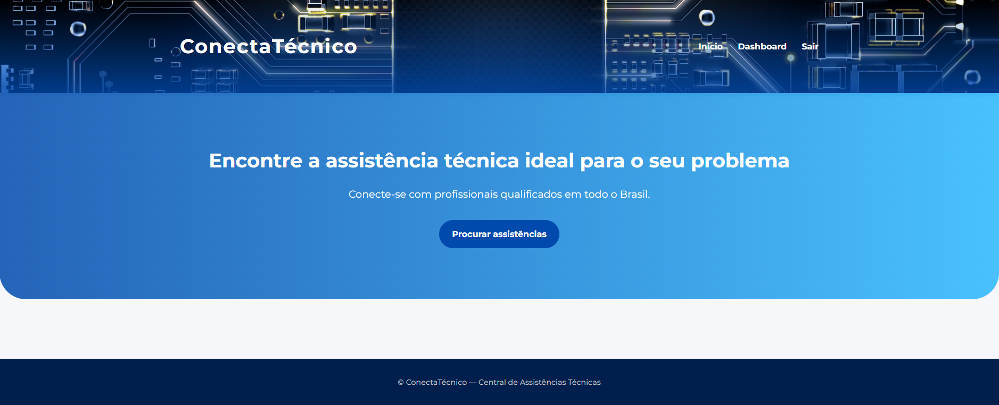
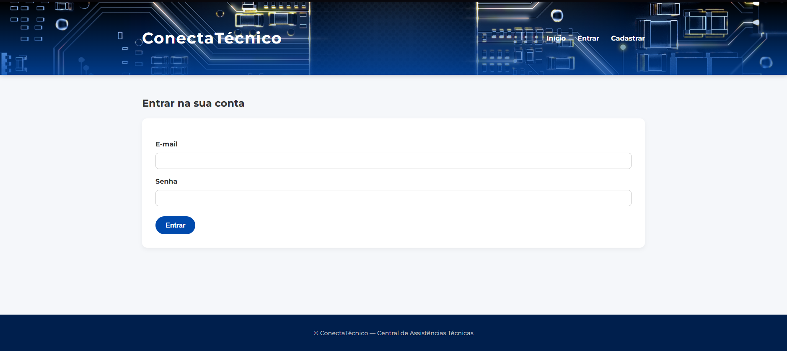
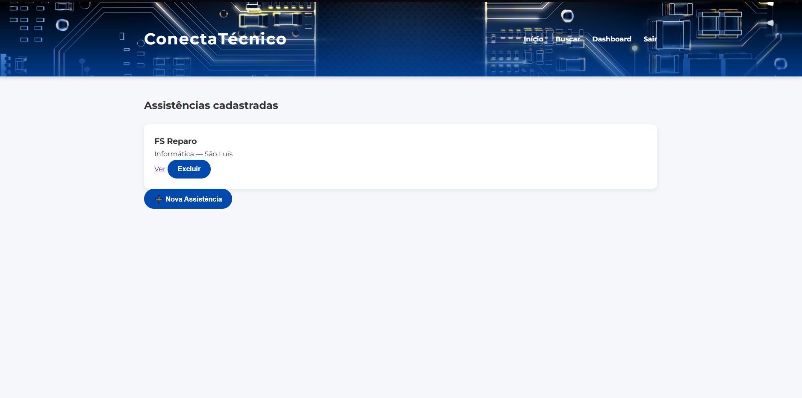
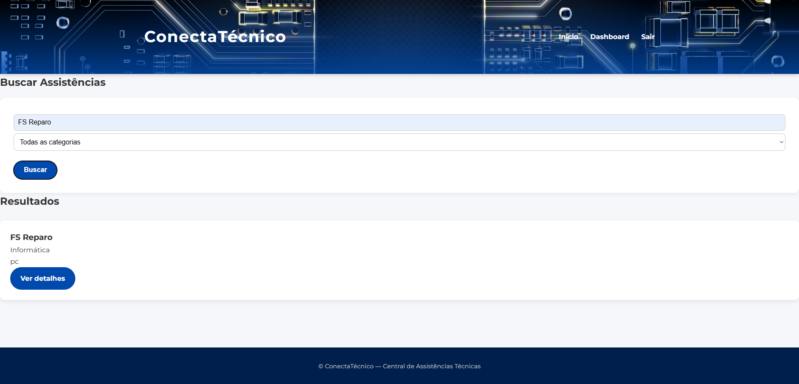
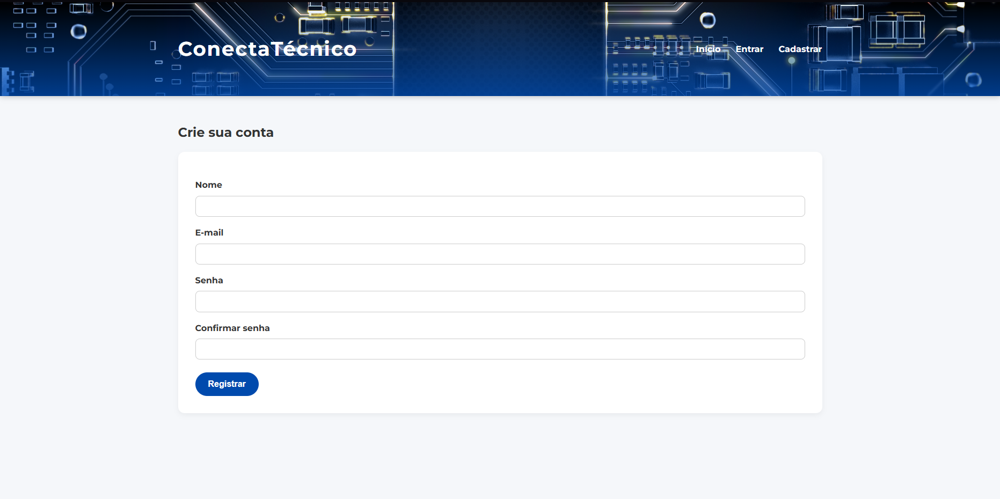
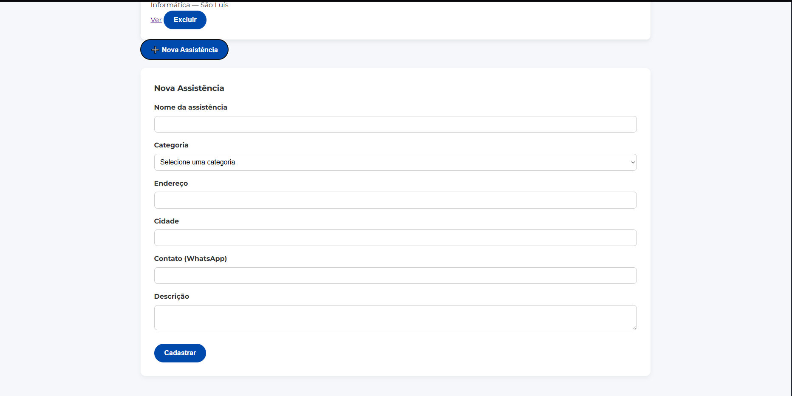
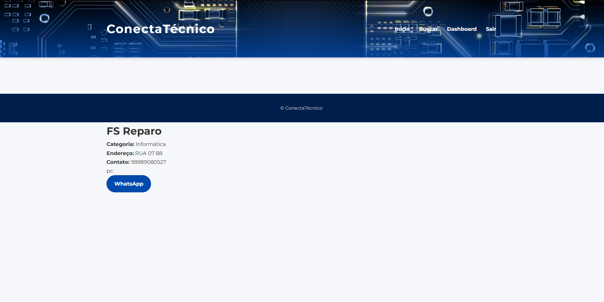
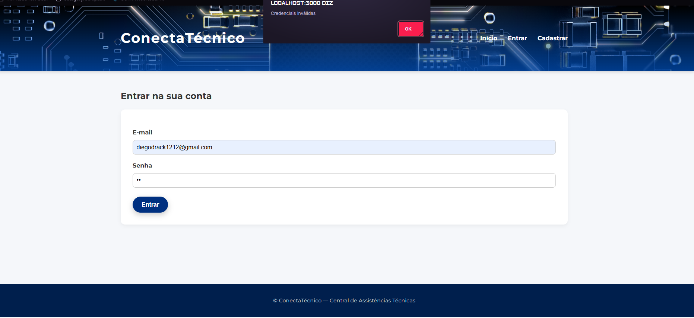

# ConectaTécnico — Central de Assistências Técnicas

## Descrição do Sistema
O ConectaTécnico é uma aplicação web desenvolvida para conectar clientes a assistências técnicas cadastradas.  
O sistema permite que técnicos criem contas, cadastrem suas assistências e que clientes possam buscar assistências por nome ou categoria, sem necessidade de login.

---

## Autor
- Nome: Diego Silva Martins
- Matrícula: 2020020050

---

### Link Video
https://drive.google.com/file/d/1QetNmI1F5Ad03WoNUHh4mJI9fLIG2Mv8/view?usp=sharing

---

## Tecnologias Utilizadas

### Backend
- Node.js v24.11.1  
- Express.js v4.x  
- SQLite3 v5.x  
- JWT v9.x  
- bcryptjs v2.x  
- dotenv v16.x  

### Frontend

- HTML5
- CSS3
- JavaScript

---

## Pré-requisitos

Antes de executar o projeto, é necessário ter instalado:

- Node.js (versão 18 ou superior)
- npm (gerenciador de pacotes do Node.js)
- Navegador web (Chrome, Edge, Firefox)

---

## Instruções de Instalação

1. Clone o repositório:
   git clone https://github.com/DiegoFSX22/ConectaTecnicoDSW.git

2. Acesse a pasta:
   cd ConectaTecnico

3. Instale as dependências:
   npm install

## Instruções de Execução

1. Para iniciar o servidor: node server.js

2. O sistema ficará disponível em: http://localhost:3000

---

## Variáveis de Ambiente

Crie um arquivo `.env` na raiz do projeto:

JWT_SECRET=sua_chave_secreta
PORT=3000

---

## Estrutura do Projeto

1.  ├── public/ → arquivos do frontend
2.  │   ├── css/
3.  │   │   └── styles.css
4.  │   ├── index.html
5.  │   ├── login.html
6.  │   ├── register.html
7.  │   ├── dashboard.html
8.  │   ├── list.html
9.  │   └── detail.html
10. │
11. ├── server.js → servidor backend
12. ├── conectatecnico.db → banco de dados SQLite
13. ├── package.json
14. └── README.md

---

## Modelo de Dados

Tabela usuario:
- id (PK)
- nome
- email
- senha
- tipo

Tabela assistencia:
- id (PK)
- nome
- categoria
- endereco
- cidade
- contato
- descricao
- usuario_id (FK → usuario.id)

---

## Funcionalidades Implementadas

1. Sistema de autenticação com login (JWT)

2. Cadastro de técnicos

3. Controle de acesso por tipo de usuário

4. CRUD completo de assistências técnicas

5. Busca de assistências por nome e categoria

6. Validação de formulários no frontend

7. Validação de dados no backend

8. Tratamento de erros e respostas HTTP adequadas

9. Persistência de dados com banco SQLite

---

## Funcionalidades Não Implementadas

1. Edição de perfil do usuário

2. Upload de imagens para assistências

3. Avaliação/comentários de assistências

4. Paginação de resultados

5. Recuperação de senha

---

## Decisões Técnicas

1. Node.js + Express: escolhidos pela simplicidade, rapidez no desenvolvimento e ampla documentação.

2. SQLite: utilizado por ser um banco leve, fácil de configurar e adequado para projetos acadêmicos.

3. JWT: adotado para autenticação stateless, sem necessidade de sessões no servidor.

4. Clientes não precisam de conta: para simplificar o uso e reduzir a barreira de entrada no sistema.

---

## Rotas / Endpoints da API

1. Autenticação:

POST /api/register — Cadastro de técnico

POST /api/login — Login do usuário

GET /api/me — Dados do usuário autenticado

2. Assistências:

GET /api/assistances — Listar/buscar assistências

GET /api/assistances/:id — Detalhes da assistência

POST /api/assistances — Cadastrar assistência (técnico)

PUT /api/assistances/:id — Editar assistência

DELETE /api/assistances/:id — Excluir assistência

---

## DOCUMENTAÇÃO DA API — ConectaTécnico

Autenticação
POST /api/register

Cadastro de usuário.

Body (JSON):

{
  "nome": "Diego Silva",
  "email": "diego@email.com",
  "senha": "123456",
}

Resposta 200 – Sucesso:

{
  "message": "Usuário criado",
  "token": "jwt_token",
  "user": {
    "id": 1,
    "nome": "Diego Silva",
    "email": "diego@email.com",
  }
}

Erros possíveis:

400 → Dados inválidos / email já cadastrado

500 → Erro no banco

 POST /api/login

Autenticação do usuário.

Body (JSON):

{
  "email": "diego@email.com",
  "senha": "123456"
}

Resposta 200:

{
  "message": "Autenticado",
  "token": "jwt_token",
  "user": {
    "id": 1,
    "nome": "Diego Silva",
    "email": "diego@email.com",
  }
}

Erros:

400 → Credenciais inválidas

500 → Erro interno

 GET /api/me

Retorna dados do usuário autenticado.

Header obrigatório:

Authorization: Bearer SEU_TOKEN

Resposta 200:

{
  "id": 1,
  "nome": "Diego Silva",
  "email": "diego@email.com",
  "data_cadastro": "2025-01-10"
}

Erro:

401 → Token inválido ou ausente

 GET /api/assistances

Lista ou busca assistências.

Resposta 200:

[
  {
    "id": 3,
    "nome": "FS Reparo",
    "categoria": "Informática",
    "endereco": "Rua 07",
    "cidade": "São Luís",
    "contato": "989999999",
    "descricao": "Manutenção de PCs",
    "usuario_id": 1
  }
]

 GET /api/assistances/:id

Detalhes de uma assistência.

Resposta 200:

{
  "id": 3,
  "nome": "FS Reparo",
  "categoria": "Informática",
  "endereco": "Rua 07",
  "cidade": "São Luís",
  "contato": "989999999",
  "descricao": "Manutenção de PCs",
  "usuario_id": 1
}

Erros:

404 → Assistência não encontrada

 POST /api/assistances

Cadastrar assistência.

Header:

Authorization: Bearer TOKEN

Body:

{
  "nome": "FS Reparo",
  "categoria": "Informática",
  "endereco": "Rua 07",
  "cidade": "São Luís",
  "contato": "989999999",
  "descricao": "Manutenção de computadores"
}

Resposta 200:

{
  "message": "Assistência cadastrada",
  "id": 4
}

Erros:

403 → Usuário não é técnico

400 → Limite de 3 assistências atingido

 PUT /api/assistances/:id

Editar assistência.

 DELETE /api/assistances/:id

Excluir assistência.

---

## Screenshots do Sistema

### Tela Inicial

### Tela de Login

### Dashboard do Técnico

### Busca de Assistências

### Tela de Cadastro

### Cadastro de Assistências

### Detalhes

### Erro de Login

---

## Dificuldades Encontradas e Soluções

1. Problemas com autenticação JWT: resolvidos com armazenamento correto do token no localStorage.

2. Erro no banco de dados SQLite: solucionado criando corretamente as tabelas e ajustando consultas SQL.

3. Busca não retornava resultados: corrigido ao ajustar os parâmetros da query na API.

4. Controle de permissões: implementado com middleware de autenticação no backend.

---

## Diagrama de Arquitetura

1.  ┌─────────────────────┐
2.  │     Frontend        │
3.  │    HTML / CSS / JS  │
4.  │ (Browser)           │
5.  └─────────┬───────────┘
6.                   │ HTTP / JSON
7.                   ▼
9.  ┌─────────────────────┐
9.  │     Backend         │
10. │ Node.js + Express   │
11. │ JWT / API REST      │
12. └─────────┬───────────┘
13.                  │ SQL
14.                  ▼
15. ┌─────────────────────┐
16. │   Banco de Dados    │
17. │      SQLite         │
18. └─────────────────────┘
